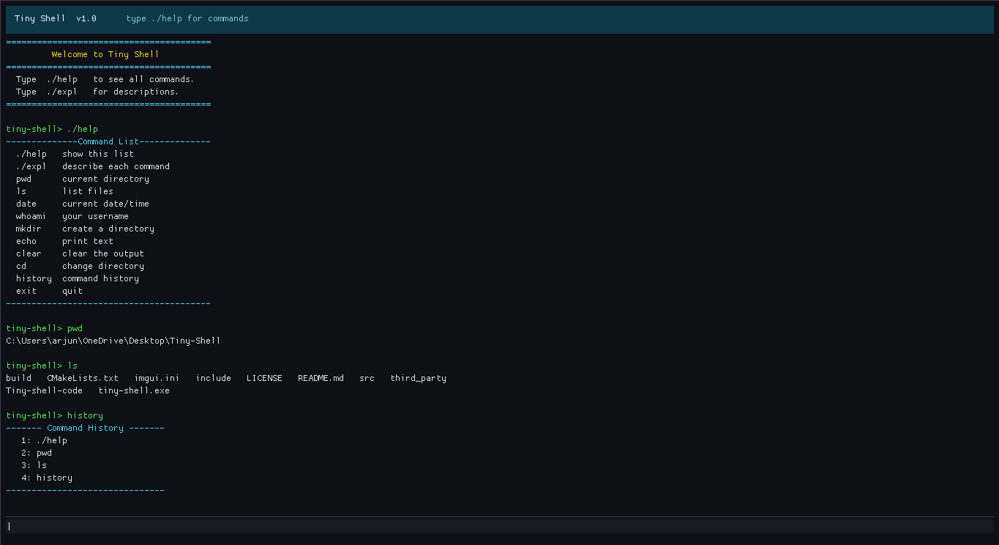

# Tiny Shell

A minimal command-line shell written in C, with a custom **Dear ImGui** graphical terminal UI.

Instead of running inside your system's terminal, Tiny Shell opens its own dark window — built with Dear ImGui and a DirectX 9 backend. No extra library installation needed; ImGui source files are bundled directly in the repo.

---

## Screenshot



---

## Features

- Dear ImGui window — no system terminal required
- Styled dark theme with a teal header bar
- Scrollable output pane with colour-coded text
  - Green — prompt echo
  - Cyan  — info / help text
  - Red   — errors
  - Yellow — success messages
- Auto-scroll to latest output
- In-session command history
- Windows-native (Win32 + DirectX 9 — both built into Windows)

---

## Commands

| Command   | Description                                              |
|-----------|----------------------------------------------------------|
| `./help`  | Show the list of all available commands                  |
| `./expl`  | Show a brief description of each command                 |
| `pwd`     | Print the current working directory                      |
| `ls`      | List files and folders in the current directory          |
| `date`    | Display the current system date and time                 |
| `whoami`  | Show the name of the currently logged-in user            |
| `mkdir`   | Create a new directory (prompts for a name)              |
| `echo`    | Print a line of text you type                            |
| `clear`   | Clear the output pane                                    |
| `cd`      | Change the current working directory                     |
| `history` | Display all commands entered this session                |
| `exit`    | Quit Tiny Shell                                          |

---

## Project Structure

```
Tiny-Shell/
│
├── include/                  # Header files
│   ├── globals.h             # extern declarations for all global variables
│   ├── commands.h            # Function prototypes for commands + utilities
│   └── ui.h                  # ImGui UI API (ui_init, ui_run, ui_shutdown)
│
├── src/                      # Source files
│   ├── main.c                # Entry point — 3 lines: init, run, shutdown
│   ├── globals.c             # Global variable definitions
│   ├── commands.c            # Shell command implementations (printf layer)
│   ├── utils.c               # check(), help(), defination(), history
│   └── ui.cpp                # Dear ImGui Win32+DX9 terminal UI
│
├── third_party/imgui/        # Dear ImGui source (bundled, no install needed)
│   ├── imgui.h / imgui.cpp
│   ├── imgui_impl_win32.*
│   ├── imgui_impl_dx9.*
│   └── ... (other imgui files)
│
├── assets/                   # Project assets
│   └── screenshot.png        # Screenshot of the running shell
│
│   └── main.c                # ← do NOT compile this
│
├── CMakeLists.txt            # Build system
├── LICENSE
└── README.md
```

---

## Dependencies

| What               | How you get it                          |
|--------------------|-----------------------------------------|
| GCC (MinGW)        | Already on your machine via MSYS2       |
| CMake              | Already installed (v3.29)               |
| Dear ImGui         | Bundled in `third_party/imgui/` ✓       |
| DirectX 9          | Built into every Windows install ✓      |
| Win32 API          | Built into every Windows install ✓      |

**Nothing to install.** Just build and run.

---

## Build & Run

Open PowerShell (or any terminal with `cmake` and `gcc` in PATH):

```powershell
# 1. Configure (only needed once)
cmake -S . -B build -G "MinGW Makefiles"

# 2. Build
cmake --build build

# 3. Run
.\build\tiny-shell.exe
```

### Rebuild after changes

```powershell
cmake --build build
.\build\tiny-shell.exe
```

### Clean build from scratch

```powershell
Remove-Item -Recurse -Force build
cmake -S . -B build -G "MinGW Makefiles"
cmake --build build
```

---

## How It Works

```
main()
  └── ui_init()
        ├── Creates a Win32 window
        ├── Initialises DirectX 9 device
        ├── Initialises Dear ImGui (Win32 + DX9 backends)
        └── Prints welcome banner into output buffer

  └── ui_run()   ← loops every frame until exit
        ├── PeekMessage()       handle Win32 events (resize, close…)
        ├── ImGui::NewFrame()
        ├── Draw header bar     (teal, title + hint)
        ├── Draw output pane    (scrollable, colour-coded lines)
        ├── Draw input bar      (InputText — always focused)
        │     └── on Enter → on_enter()
        │               ├── add_to_history()
        │               └── dispatch()  → cmd_pwd / cmd_ls / etc.
        ├── ImGui::Render()
        └── d3d_device->Present()

  └── ui_shutdown()
        ├── ImGui cleanup
        ├── DirectX 9 cleanup
        └── Destroy Win32 window
```

---

## Author

Built by Arjun as a systems + graphics programming project — combining a custom shell implementation with a Dear ImGui terminal renderer.

---

## License

This project is licensed under the terms in the [LICENSE](LICENSE) file.
